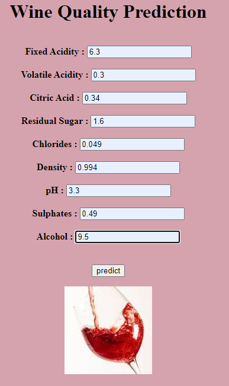
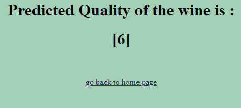

# Wine Quality Prediction Flask App

## Overview

This Flask web application predicts the quality of wine based on nine factors using a RandomForestClassifier model. Users can input the relevant features, and the app will provide a predicted quality score.

##Prediction





## Features

- **RandomForestClassifier Model:** The app utilizes a machine learning model built with the RandomForestClassifier algorithm to predict wine quality.

- **User-Friendly Interface:** A clean and intuitive web interface allows users to input wine-related features easily.

- **Scalability:** The app is designed to handle predictions for a large number of users concurrently.

## Prerequisites

Ensure you have the following dependencies installed before running the application:

- Python (>=3.6)
- Flask
- scikit-learn
- Other necessary libraries (install via `pip install -r requirements.txt`)

## Getting Started

1. Clone the repository:

   ```bash
   git clone https://github.com/SARDARJI222/wine_quality_predict.git
   cd wine_quality_predict
